# Wrapped das Mariannnas

Um presente digital criado para celebrar a história de dois anos com o meu amor. Inspirado no ritmo narrativo do Spotify Wrapped e dos Stories, ele transforma datas, lugares, fotos, música e pequenas lembranças em uma experiência vertical feita para o celular.

Ao longo de 17 capítulos, o presente relembra onde tudo começou sob a nossa constelação, revela a comida e a música do casal, registra o jogo do Fluminense, celebra a série *Brooklyn Nine-Nine*, reúne memórias, respostas de “Quem é mais?”, uma carta de amor digital, a linha do tempo do relacionamento e pequenos motivos para amar. As telas usam tipografia cinética, fotos que surgem como revelações e um player do Spotify dentro da própria história.

## Experiência

- Narrativa mobile-first com avanço automático, pausa, toque e gesto lateral.
- Editor privado para textos, respostas, datas, fotos e música.
- Imagens persistidas em um bucket privado do Supabase Storage.
- Link público somente para leitura, sem acesso ao painel de edição.
- Resumo final em formato de pôster, pronto para compartilhar.

## Tecnologias

- **React e TypeScript** para a experiência interativa.
- **Vite** para desenvolvimento e construção do projeto.
- **Tailwind CSS** para o visual responsivo e mobile-first.
- **Framer Motion** para animações e transições.
- **Supabase** para autenticação, dados e armazenamento privado.
- **Spotify** para a música especial do casal.
- **NASA** para referências do céu na data em que tudo começou.
- **Vercel** para publicação do presente na internet.

## Organização

Os capítulos visuais vivem em `src/components/Slides`, o editor em `src/components`, os dados iniciais em `src/data` e as integrações e regras reutilizáveis em `src/lib` e `src/utils`. O backend versionado fica em `supabase`, com migrações e Edge Functions.

Feito para nós duas, com amor, memória e um pouco do nosso caos.